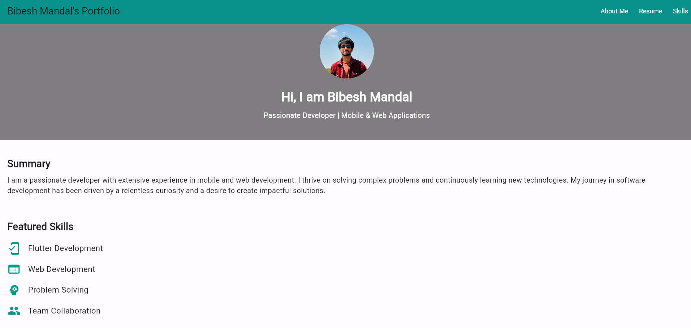
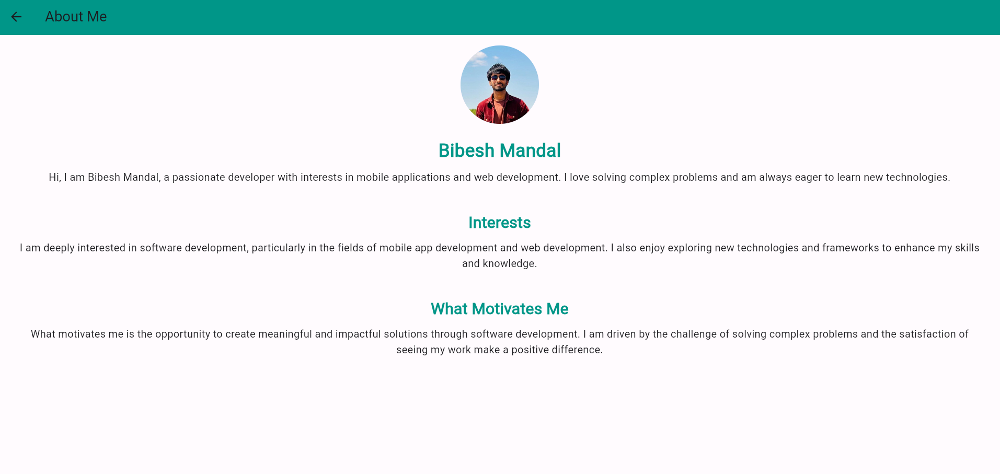
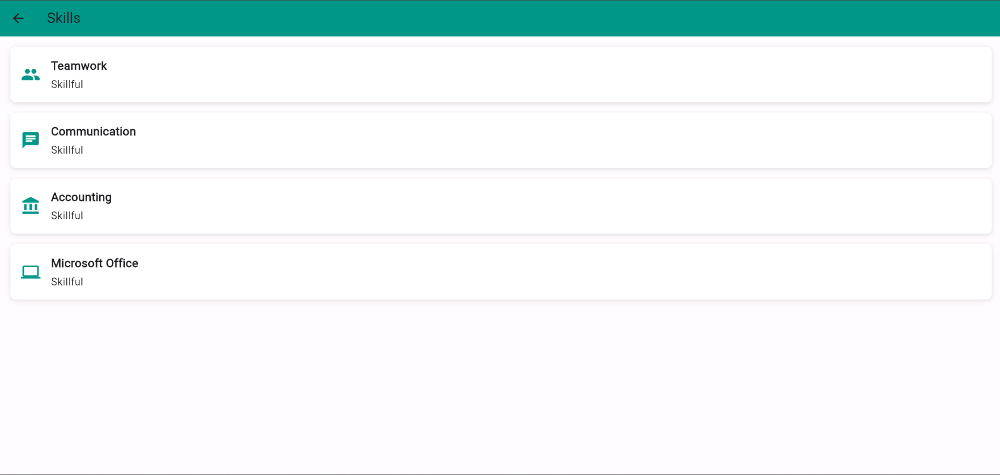
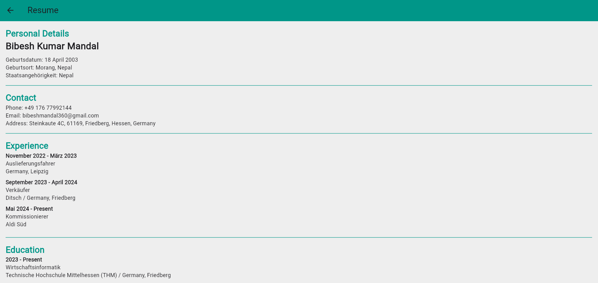

# portfolio_5499126

A new Flutter project.

About me
Name : Bibesh Kumar Mandal
Matrikelnummer : 5499126
Email : bibesh.kumar.mandal@mnd.thm.de

Hosted URL: https://portfolio-c16b5.web.app/


## Getting Started

# Flutter Portfolio App

This Flutter application serves as a portfolio app to showcase personal information, skills, and contact details. The app consists of multiple pages such as Home, About, Skills, and Resume, each providing different sections of the portfolio.

## Navigation

Navigation in this app is managed using the Navigator widget, which allows moving between different screens. The main navigation method used in this app is through the AppBar where links to different sections are provided.
### The main routes include:

- / - Home Page
- /about - About Me Page
- /resume - Resume Page
- /skills - Skills Page
### Navigation Example

```dart
onPressed: () {
  Navigator.push(
    context,
    MaterialPageRoute(builder: (context) => AboutPage()),
}
```

## Widgets

### MaterialApp
- Used to set up the application and define routes for navigation.

### Scaffold
- Provides the basic structure for each page, including the AppBar and Drawer.

### AppBar
- Displays the title of the current page at the top.

### Column
- Organizes the content vertically on each page.

### Padding
- Adds padding around the content for better layout.

### Text
- Displays text on the screen with customizable styles.

### SizedBox
- Adds space between widgets.

### CircleAvatar
- Displays a circular profile image on the AboutPage using NetworkImage for the source.

### SingleChildScrollView
- Allows the content to be scrollable, useful for pages with more content than can fit on the screen.
### ListTile
- Used inside the skills section to list all the skills.

## Screenshots:
### Homepage:


### Aboutme:



### Skills:


### Resume:



